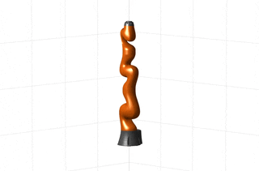

## **Multiple-Shooting Differential Dynamic Programming**

This repo holds the accompanying code for the paper *[A Unified Perspective on Multiple Shooting in Differential Dynamic Programming](https://arxiv.org/pdf/2309.07872.pdf)*. This public code is written in MATLAB, and is intended to guide the readers to quickly understand the underlying logic.

## Demo
### Single-Shooting DDP
   

### Multiple-Shooting DDP
   

## Dependencies
- [spatial_v2_extended](https://github.com/ROAM-Lab-ND/spatial_v2_extended)
- [Casadi](https://web.casadi.org/get/)
- [Robotics System Toolbox](https://www.mathworks.com/products/robotics.html)(optional for the Kuka )

## To Start
Modify the `startup.m` script to add PATH_TO_CASADI and PATH_TO_SPATIAL_V2 to MATLAB search path. Navigate to the root directory (Multiple-Shooting-DDP in this case), and run startup.m
```
startup
```

## Examples
**Always keep the root directory as the current folder**

### Acrobot Swingup
```
Acrobot_Swingup
```

### Double Pendulum
```
DP_Swingup
```

### Manipulator Swing
```
IIWA_Swing
```
### Quadrotor

```
Quadrotor_fly
```

## To Cite
```
@article{li2023unified,
  title={A Unified Perspective on Multiple Shooting In Differential Dynamic Programming},
  author={Li, He and Yu, Wenhao and Zhang, Tingnan and Wensing, Patrick M},
  journal={arXiv preprint arXiv:2309.07872},
  year={2023}
}     
```
